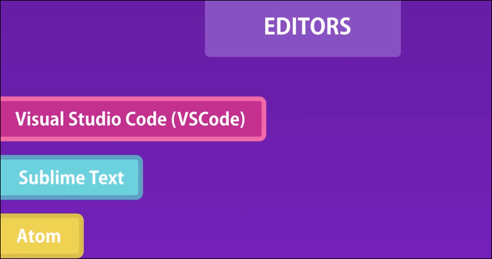

# JavaScript - Setting Up the Development Environment

## Pre-Requisites
> JavaScript 를 구동하기 위해 미리 설치해둬야 하는것들이 있음

---

### Code Editor 설치
> JavaScript 코드를 동작시키기 위해선 Code Editor가 필요함
> 
>> 본인은 Visual Studio Code 를 사용함

- [VS Code](https://code.visualstudio.com/)는 해당 링크에서 설치가능 
 


---

### Node.js 설치
> JavaScript를 Back-end 단에서 사용하기 위해 Node를 설치해줘야 함

> Node는 JavaScript의 Runtime environment(구동 환경)

> Node와 Express 라는 JavaScript의 유명한 framework로 back-end web 과 mobile 어플리케이션을 구축 가능함

> Node를 사용해 3rd party 라이브러리 설치에 용이

- [Node.js](https://nodejs.org/en/) 링크에서 설치 가능
  
    
    - 본인은 가장 많은 유저가 사용한다고 추천된 12.16.1 LTS 버전을 설치함

- Node를 설치하던 중 Chocolatey 라는 윈도우 전용 Package Manager 도 같이 설치할거냐는 질문에 OK 해줌
- [Chocolatey](https://chocolatey.org/) 링크에 접속하여서도 설치 가능

    

---

### Live Server 설치
> 서버 구동을 위한 lightweight web server인 Live Server를 설치해줌

- VS code의 'extensions' 에서 'Live Server' 검색 후 install 
  
    

- 'index.html' 파일 생성
  
    
    - '!' 표를 입력 후 'tap' 키를 입력하면 html 기본 형태가 입력됨
  
- 'index.html' 파일을 'Live Server'로 실행시키기
  
    
    
    아직 아무 내용이 없는 공백의 web page 실행됨

- JavaScript 코드 작성을 위한 준비 끝!!

---

## JavaScript Element 
> JavaScript 코드를 작성을 위해선 JavaScript Element 가 필요함

> Script Element는 Head 와 Body section에 입력가능함
>> Script Element에 대한 연습할 때에는 Head 보다는 Body section 에서 하는게 좋음
>>
>> Head 에 JavaScript 코드가 많으면 추후에 browser가 parsing 될때 바빠짐 (page 안의 content 들이 render되지 않을 수도 있음)

>> 거의 대부분의 경우 Script Element들은 web page의 elements 와 연동되어야 하는데 이때 body section의 끝부분에 script element가 위치해 있는것이 좋음

>> ! 단 예외로, 3rd party 코드를 사용시에는 반드시 해당 코드가 Head section에 위치해 있어야 함

---

### Body section에 Script Element 입력
- index.html 파일에 해당 코드 입력

    ```html
        <!DOCTYPE html>
    <html lang="en">
    <head>
        <meta charset="UTF-8">
        <meta name="viewport" content="width=device-width, initial-scale=1.0">
        <title>Document</title>
    </head>
    <body>
        <h1>Hello World</h1>
        <script>
            // First JavaScript code!
            console.log('Hello World');
        </script>
    </body>
    </html>
    ```
- 위의 코드를 입력 후 web page를 refresh 후 console 창 확인
  
    
    - console 창은 window의 경우 ctrl + shift + i 로 바로 확인
    - mac 의 경우 alt + i 로 바로 확인

---

## Separation of Concerns - Separate HTML code from JavaScript code
> 많은 양의 내용을 담고 있는 JavaScript 코드를 'index.html' 이 아닌 다른 곳에 분리하여 저장

---

### 'Index.js' 파일 생성 후 Script Element 입력하기
- 'index.html' 에 있던 script 코드 이동
  
    
    - 빨간 박스로 표시된 부분처럼 reference 입력하여 연동 

- 해당 코드가 여전히 잘 작동되는지 확인
  
    

---

## JavaScript in Node
> 위에서 작성한 코드를 Node에서 작성하기 위해선 어떻게 해야하는지를 알아보겠음

---

### 프롬프트 창에서 Node로 js파일 실행
- 프롬프트 창을 열고 우선 js파일이 있는 디렉토리로 이동
  
    

- 해당 명령어 입력
    ```linux
    node index.js
    ```

    
    - web console 에서 확인가능한 message와 같은 message 출력 
    - JavaScript 코드를 web에서 실행시킨 것과 같은 결과 출력
  - --> Node 는 JavaScript 코드를 실행 가능하게 하는 Runtime Environment