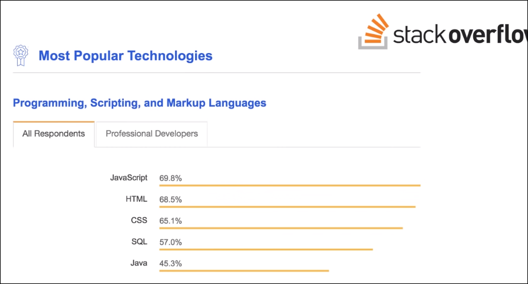
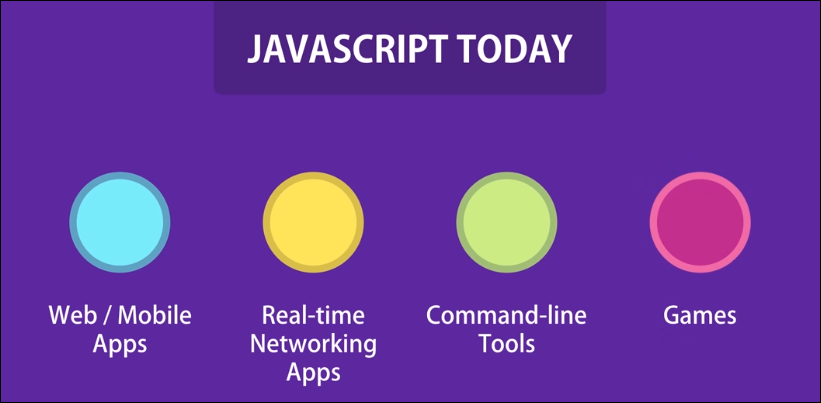
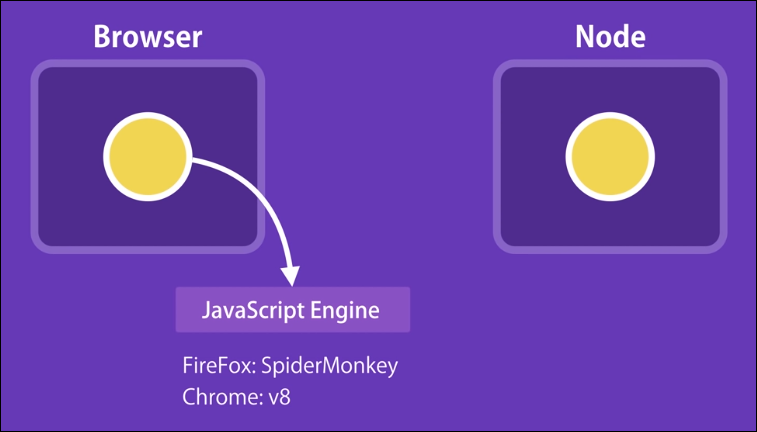
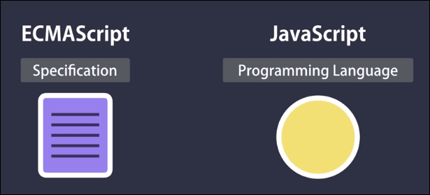

# JavaScript - Intro

## What is JavaScript?
> 현재 세계적으로 가장 많이 쓰이고 있는 프로그래밍 언어!

> NETFLIX, WalMart, PAYPAL 등에서 쓰임

> Front-end, Back-end (or both), Full-stack 개발자 모두 사용

> 인터프리터 프로그래밍 언어

## What can you do with it?
> 기존에는 주로 Interactive 웹 개발할때 주로 쓰였음

> 현재는 다양한 분야에서 사용됨
> 

## Where does JavaScript code run?
> 기존에는 Browser 에서만 JavaScript Engine에 의해 동작되도록 디자인 되었었음

> 그러나 2009년 Ryan Dahl 이라는 엔지니어가 크롬의 JavaScript의 Runtime Environment를 제공해주는 C++로 작성된 V8엔진을 가져다가 일반적인 OS System 에서의 Runtime Environment 를 구성함 ==> Node.js
>
> Node를 통해 이제 Browser 밖에서도 자바 스크립트를 구동 가능하게 됨 
> 
>>--> Web 과 Mobile에 필요한 back-end 를 자바 스크립트로 구축가능하게 됨

> 

- JavaScript의 Runtime Environment는 두개로 분류 가능
  - Web Browser 환경에서의 JS
  - Node 환경에서의 JS

## JavaScript vs ECMAScript?
> ECMAScript 는 그냥 Specification 임(a technical contract b/w a programmer and client)
> 
 >> ECMAScript is a Standard for scripting languages such as JavaScript