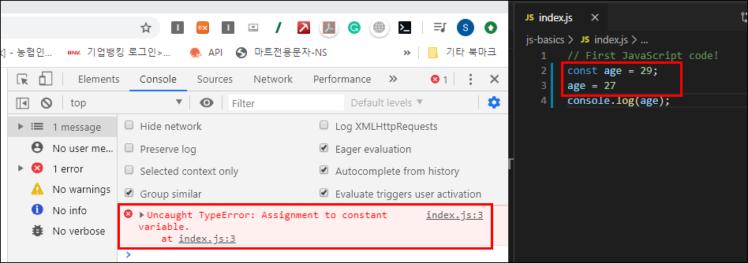
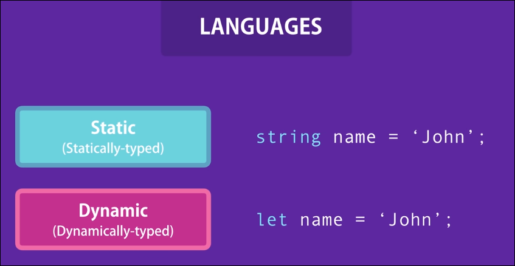
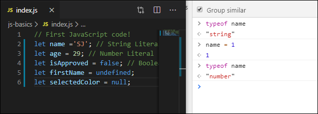
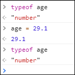
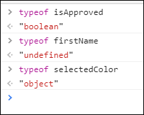
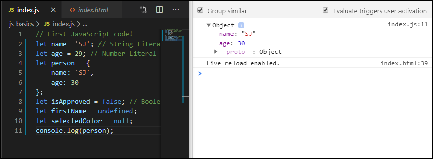
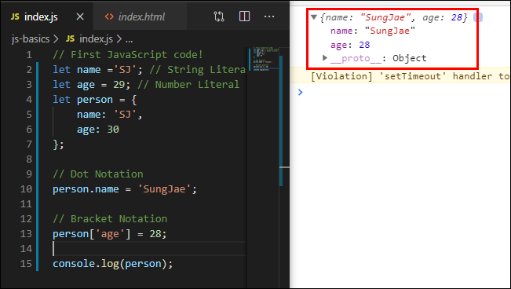
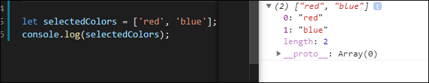
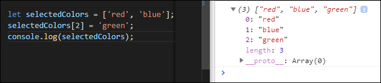
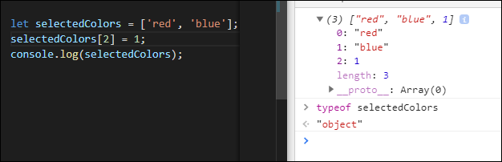

# JavaScript(3) - Basics(Variable, Constant and etc) in JavaScript
> 자바스크립트의 기본적인 내용들에 대해 배워보겠음

## Variable?
 - To store data temporarily
 - let - 변수 선언시 사용
    - ex) let name; - name 이라는 이름의 변수 선언

### 변수 선언시 조심해야할 것들
- 이미 약속되어 사용중인(reserved) 키워드는 불가
  - let, if, else, var 등
- Should be meaningful
  - name, age instead of a, b
- 변수 이름이 숫자로 시작하면 안됨
  - 1name, 2age 등
- 공백과 하이픈이 있으면 안됨
  - first name, first-name 등
- Are case-sensitive
  - firstName 처럼 한번 카멜 형태로 했으면 계속 카멜형태로 사용
  - 별개의 라인에 변수 선언
    ```JavaScript
    let firstName = 'Sungjae';
    let lastName = 'Lee';
    ```
---

## Constants
> 바로 예시확인

- const 옵션으로 변수가 선언되면 중간에 해당 변수의 값이 변경 불가 (error 발생)
  
  

- 코드 중간에 변수의 값이 변할 수도 있는 경우 const 대신 let 을 사용하여 변수선언 해주기

---

## Primitive Types
> 자바스크립트에서 사용되는 Primitive type 들에 대해 알아보겠음

- String
- Number
- Boolean
- Undefined
- Null

### 예시
```JavaScript
let name ='SJ'; // String Literal
let age = 29; // Number Literal
let isApproved = false; // Boolean Literal
let firstName = undefined;
let selectedColor = null; 
```

## Dynamic Typing
> JavaScript는 Dynamic Language 중 하나임

  

- Static: 변수가 한번 선언되면 이후에 바뀔수가 없음
- Dynamic: 변수 선언 후에도 변수의 내용이 바뀔 수 있음

  
  - 변수타입이 변경됨
  - Static 언어에선 변경 불가

  
  - JavaScript 는 다른 언어들과는 달리 float 타입이 따로 없고 모두 number 타입임

  
  - Undefined 는 타입중 하나 임과 동시에 value임 
  - Null은 Object 타입??

---

## Object
> Object는 Reference type 중 하나

### What is an Object?
- Object in real life
- Person 이라는 object 는 age, name 등의 특징을 가질 수 있음

  
  - Person object

- Person object에 접근하는 방법

    
  - Dot Notation
  - Bracket Notation

---

## Arrays
> 예시 확인
> 
```javascript
let selectedColors = ['red', 'blue'];
console.log(selectedColors);
```


    - array 안의 각 값의 index 또한 표시됨

### Index로 접근하기
- 값 red의 index인 0 으로 접근
```javascript
console.log(selectedColors[0]);
```

### Array에 값 추가하기
```javascript
let selectedColors = ['red', 'blue'];
selectedColors[2] = 'green';
console.log(selectedColors);
```



- 또한 JavaScript 에선 array 안의 값들이 다른 타입이어도 상관없음
  
  
  - string과 number 타입이 동시에 존재
  - selectedColors의 타입은 Object 타입

---

